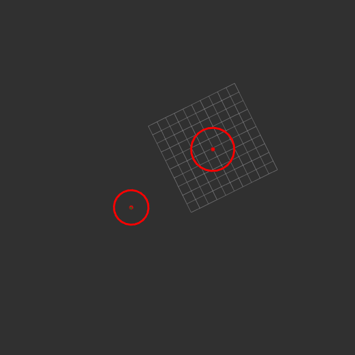

# MTT ROS
An implementation and vomparison of several Rmulti target tracking algorithms in ROS (C++).

## Table of Contents

- [What is the MTT Problem](#what-is-the-mtt-problem)
- [Proposed Methods](#proposed-methods)
- [How to run the code](#how-to-run-the-code)
- [Roadmap](#roadmap)

## What is the MTT Problem
Multi-target tracking (MTT) problem can be described as a mathematical problem involving tracking multiple point objects using noisy sensor data collected from each target and the surrounding environment. 

## Proposed Methods

### GNN Based MTT :

## How to run the code
Clone the repo with `git clone --recurse-submodules https://github.com/aeblc/mtt_ros`. Play one of the rosbags given in `rosbags/` folder.
Run the `rviz.launch` file for the desired package. 

### Roadmap

- [x] Implement GNN Based MTT
- [ ] Implement PDA Based MTT
- [ ] Implement JPDA Based MTT
- [ ] Implement MHT Based MTT
